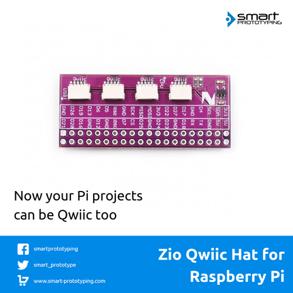

# Zio Qwiic HAT for Raspberry Pi

> This product can be available for purchase [here](https://www.smart-prototyping.com/Zio-Qwiic-Hat-for-Raspberry-Pi).

#### Description

We will not be satisfied if you cannot use Qwiic system on Raspberry Pi in a Qwiic way, this is why we made this Qwiic Hat for Raspberry Pi. It has a standard shield design like other Raspberry Pi add-ons.

Our Qwiic Hat has eight Qwiic connectors that connect to Raspberry Pi’s I2C pins, so they all have the same I2C address.  We also add the original Pi’s ’pin names on the board for your reference.

We have two different version 2x20 female headers to offer, long pin and short pin (optional). With the long pin header, you can stack up against other Pi add-on shield. Please note that the 2x20 pin header is not pre-soldered.

#### Specification

* Board Dimension: 22.3x51.0mm
* Weight: 11.1g
* Long pins female header’s pin length: 12.2mm

#### Links

* [PCB source file and schematic](https://github.com/ZIOCC/Zio-Qwiic-HAT-for-Raspberry-Pi)

> ###### About Zio
> Zio is a new line of open sourced, compact, and grid layout boards, fully integrated for Arduino and Qwiic ecosystem. Designed ideally for wearables, robotics, small-space limitations or other on the go projects. Check out other awesome Zio products [here](https://www.smart-prototyping.com/Zio).
